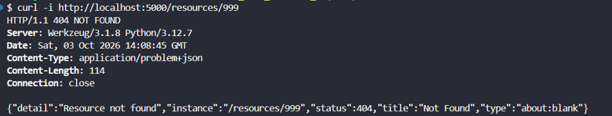
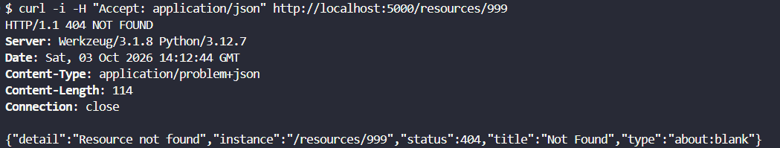
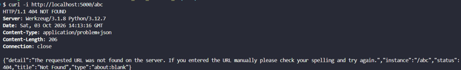
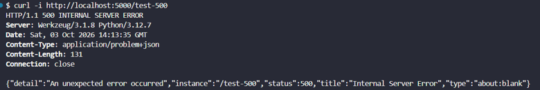
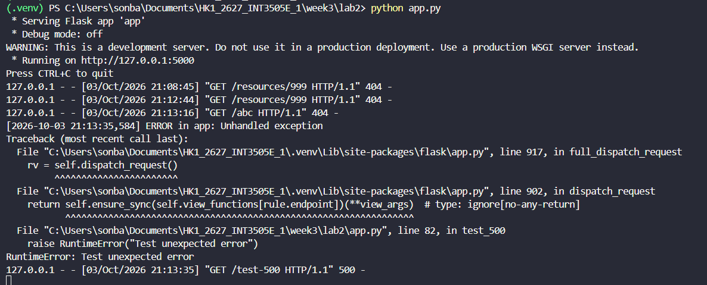

# LAB 2

## Test 1 - Resource không tồn tại

```http
GET /resources/999
```

Kết quả: server trả `404 Not Found` với `Content-Type: application/problem+json`. Response body có đầy đủ các trường `type`, `title`, `detail`, `status` và `instance`



---

## Test 2 - Client gửi `Accept: application/json`

```http
GET /resources/999
Accept: application/json
```

Kết quả: server trả lỗi theo định dạng `application/problem+json`



---

## Test 3 - Fallback cho `HTTPException`

Gọi một endpoint không tồn tại:

```http
GET /abc
```

Kết quả: Flask phát sinh lỗi `404 Not Found` và handler `HTTPException` chuyển lỗi mặc định thành response theo định dạng `application/problem+json`



---

## Test 4 - Exception chưa được bắt

```http
GET /test-500
```

Kết quả: client nhận `500 Internal Server Error` với thông báo trung tính, không bị lộ stack trace hoặc thông tin nội bộ của server



---

## Test 5 - Kiểm tra log phía server

Khi endpoint `/test-500` phát sinh exception, terminal phía server ghi lại đầy đủ traceback và thông tin lỗi



