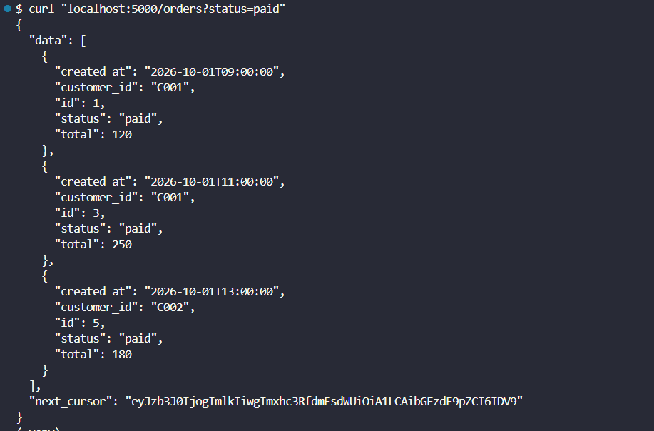
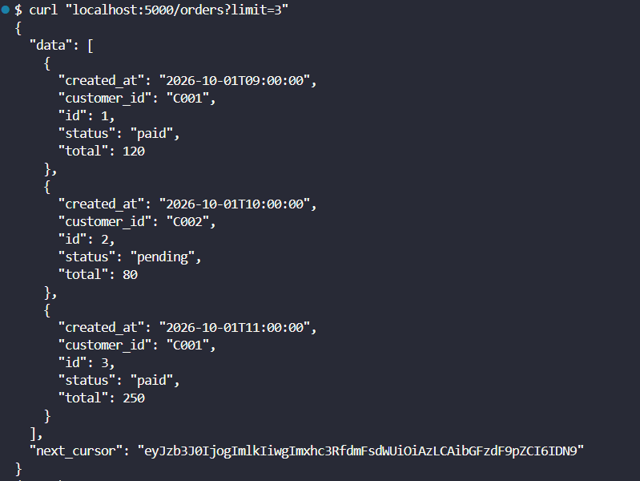
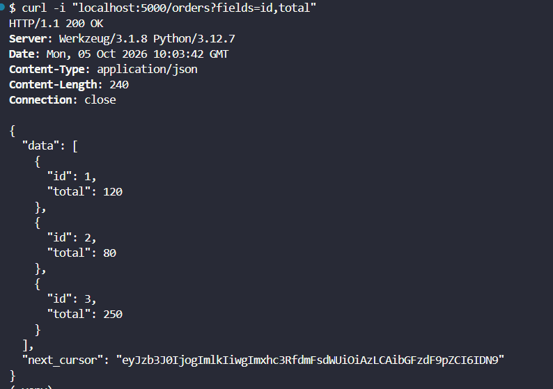
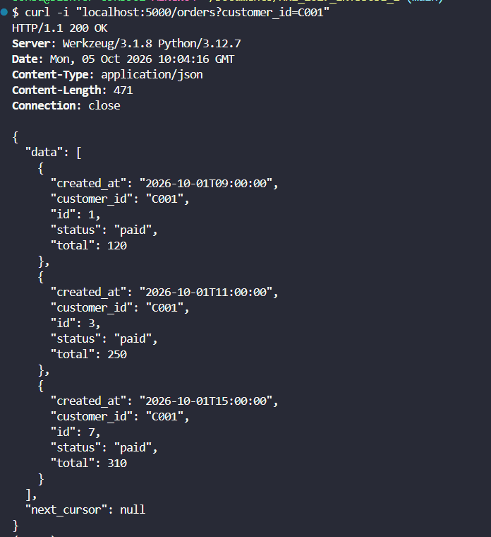
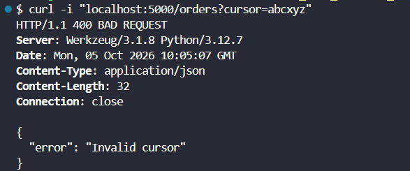
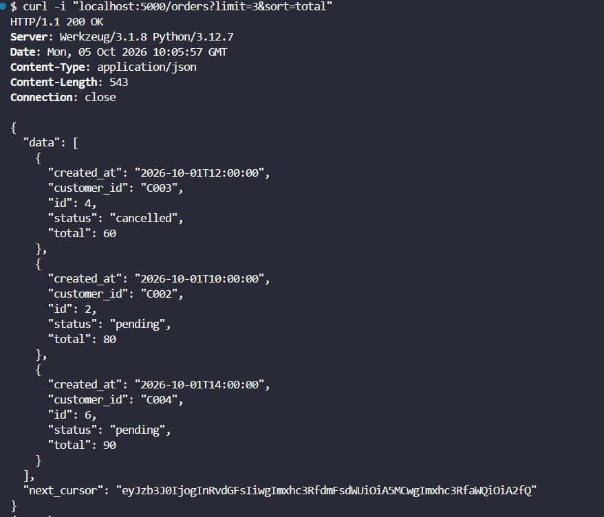
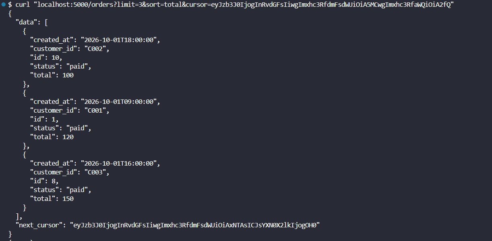

# LAB 3 - Triển khai `/orders` với Cursor Pagination

## Test 1 - Filter theo `status`

```bash
curl "localhost:5000/orders?status=paid"
```

Kết quả: API chỉ trả về các order có `status = paid`. Nếu số lượng kết quả vượt quá giới hạn của một trang thì response trả thêm `next_cursor`



---

## Test 2 - Giới hạn số lượng kết quả với `limit`

```bash
curl "localhost:5000/orders?limit=3"
```

Kết quả: response chỉ trả tối đa 3 order trong `data` và cung cấp `next_cursor` để lấy trang tiếp theo



---

## Test 3 - Sparse fieldsets

```bash
curl -i "localhost:5000/orders?fields=id,total"
```

Kết quả: mỗi order chỉ trả về hai field được yêu cầu là `id` và `total`, thay vì trả toàn bộ thông tin của order



---

## Test 4 - Filter theo `customer_id`

```bash
curl -i "localhost:5000/orders?customer_id=C001"
```

Kết quả: API chỉ trả về các order thuộc khách hàng có `customer_id = C001`



---

## Test 5 - Cursor không hợp lệ

```bash
curl -i "localhost:5000/orders?cursor=abcxyz"
```

Kết quả: server trả `400 Bad Request` cùng thông báo `Invalid cursor`, đúng yêu cầu khi cursor bị hỏng hoặc không hợp lệ



---

## Test 6 - Sort theo `total`

```bash
curl -i "localhost:5000/orders?limit=3&sort=total"
```

Kết quả: các order được sắp xếp tăng dần theo `total`. Response trả 3 phần tử đầu tiên và kèm `next_cursor` để lấy trang tiếp theo



---

## Test 7 - Cursor kết hợp với Sort

Dùng `next_cursor` nhận được từ Test 6 để gọi trang tiếp theo:

```bash
curl "localhost:5000/orders?limit=3&sort=total&cursor=NEXT_CURSOR"
```

Kết quả: API tiếp tục trả các order kế tiếp theo đúng thứ tự `total` tăng dần, không lặp lại các phần tử của trang trước


